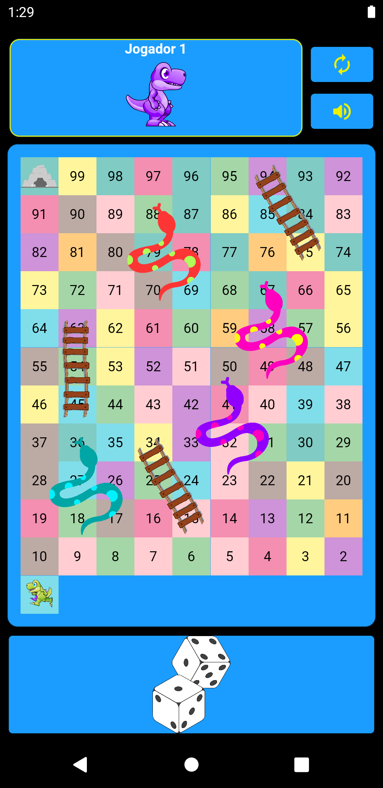
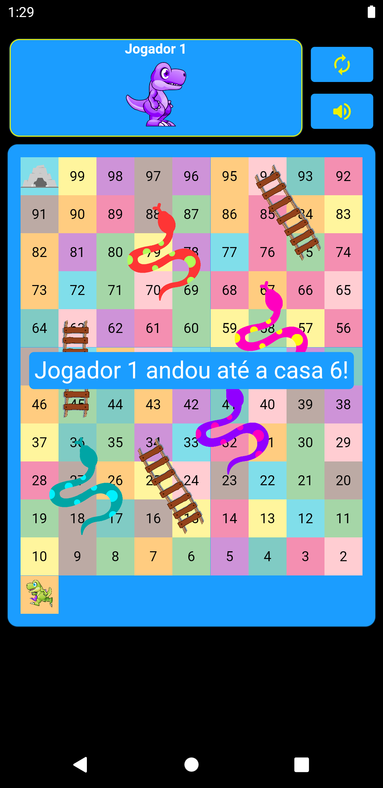
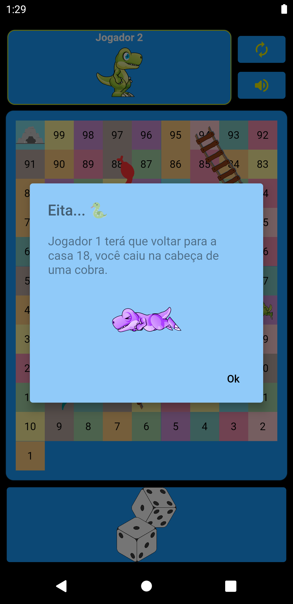
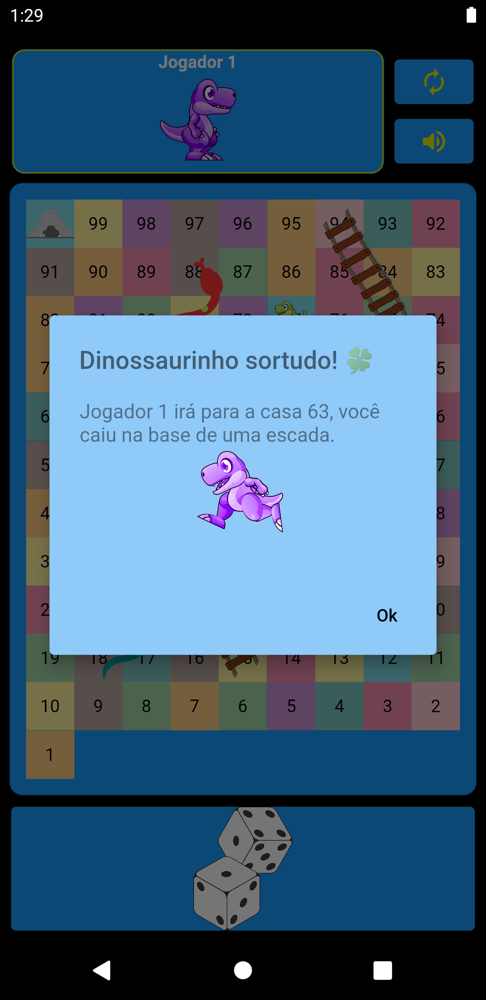
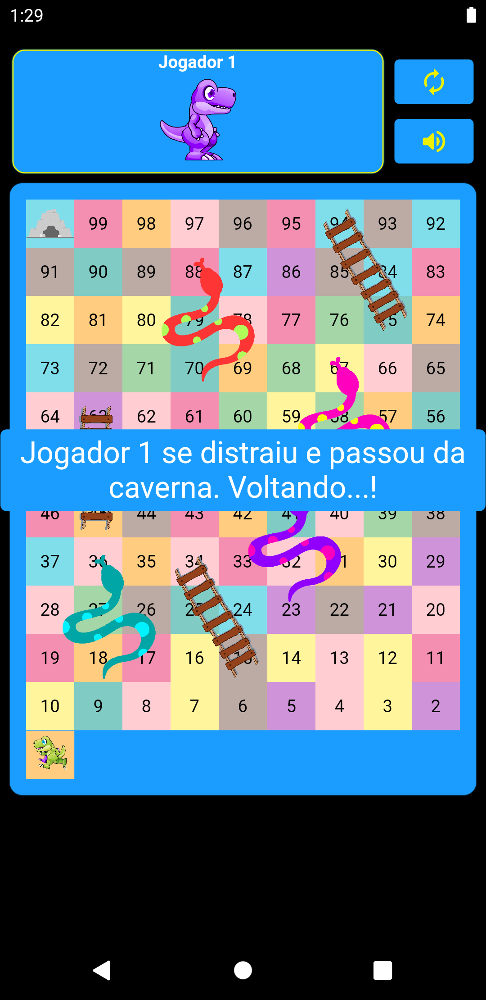

# Mobile Game infantil baseado no jogo indiano "Cobras e Escadas"

As regras do jogo são simples: existem dois jogadores com o objetivo de chegar até a posição 100 do tabuleiro. Mas durante o percurso, caso caia numa casa onde há uma cabeça de cobra, deverá voltar para onde está localizado o rabo dela. Da mesma forma, caso caia na base de uma escada, poderá avançar para a outra ponta dela.

Importante: para vencer, você deve cair exatamente na posição 100 do tabuleiro, marcada por uma caverna.

O jogo foi desenvolvido tendo como base um dispositivo Google Pixel 3A.

## Como executar o jogo

- Para fazer o aplicativo funcionar, basta abrir um terminal no seu repositório local do projeto e digitar:

        flutter pub get

- Quando o comando terminar de rodar, digite no terminal:

        flutter run

## Prints da Aplicação

     

## Assets

- Alguns dos assets utilizados nessa aplicação foram adquiridos nos sites PngTree, FlatIcon e gratisPng. Outros foram baixados destes locais mas editados por mim.
